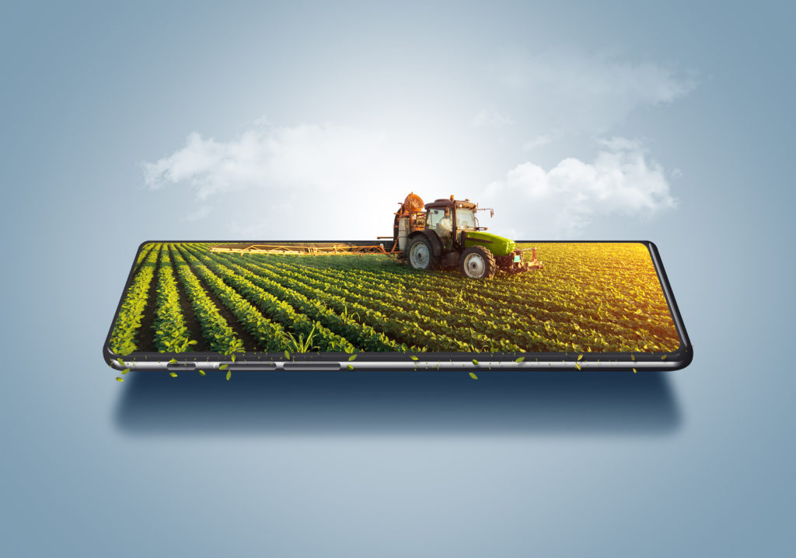

```{r setup, include=FALSE}
knitr::opts_chunk$set(echo = TRUE, warning = FALSE)
library(knitr)
library(ade4)
library(FactoMineR)
```

```{r logo1, echo=FALSE, out.width = '50%', fig.align = "center", fig.cap="Transformation digitale (Libre de droit)"}

```

# Introduction

Ce rapport s'inscrit dans le module OPEN. Il constitue un mode d'évaluation de ce module avec une note individuelle. Le sujet traite du *numérique dans l'agroalimentaire* et plus précisement **des transformations du numérique** ainsi que de **l'impact de la digitalisation sur ce secteur**.

# Objectifs

L'objectif principal est de concevoir un rapport en PDF via un fichier Rmd. Le rapport devra faire envrion 4 pages et devra contenir à minima 3 sources bibliographiques. Du code, des figures ou bien des images peuvent être ajoutés au rapport.

## Les transformations numériques dans l'industrie agroalimentaire

La transformation numérique révolutionne l'industrie agroalimentaire en offrant de nombreuses opportunités pour améliorer l'efficacité, la traçabilité et la durabilité. Cette évolution est essentielle pour répondre aux défis actuels tels que la compétitivité, les exigences réglementaires et les attentes des consommateurs en matière de transparence d'information.

### La digitalisation des processus de production

L'adoption de technologies numériques telles que l'Internet des objets (IoT) et l'intelligence artificielle (IA) permet une automatisation accrue et une surveillance en temps réel des chaînes de production. 
Cette connectivité a plusieurs avantanges : 

-   Améliore l'efficacité opérationnelle,
-   Réduit les coûts et minimise les erreurs humaines [@farweb_ti_avantages_2020].

*Par exemple, l'utilisation de capteurs connectés facilite la collecte de données en temps réel sur les performances des équipements, permettant une maintenance prédictive et une optimisation des processus.* 

### La traçabilité et sécurité alimentaire

Les systèmes de traçabilité numériques (blockchain par exemple) offrent une transparence totale sur le parcours des produits : de la production à la distribution. Cette transparence renforce la confiance des consommateurs et facilite la gestion des rappels produits en cas de contamination ou de non-conformité identifiées. Des entreprises agroalimentaires intègrent ces technologies pour assurer une traçabilité précise et en temps réel répondant ainsi aux exigences réglementaires et aux attentes des clients [@farweb_ti_avantages_2020].

### L'optimisation de la chaîne d'approvisionnement

Les plateformes cloud et les logiciels de planification des ressources d'entreprise (comme les ERP ou les MES) améliorent la gestion des stocks ainsi que la prévision de la demande et la logistique. L'analyse des données massives permet de comprendre les tendances de consommation et d'ajuster la production en conséquence. [@le_bayon_comment_2021].

*Par exemple, l'analyse des données de vente et des comportements des consommateurs aide les entreprises à anticiper les fluctuations de la demande et à optimiser leurs chaînes d'approvisionnement.* 

### L'amélioration de la qualité et de l'efficacité énergétique

Les capteurs intelligents et les systèmes de contrôle avancés permettent une surveillance précise des paramètres de fabrication. Ceux-ci garantissent une meilleure qualité des produits. De plus, l'utilisation d'outils numériques favorise une gestion plus efficace de la consommation énergétique réduisant ainsi l'empreinte carbone du secteur [@farweb_ti_avantages_2020].

*Par exemple, la surveillance en temps réel de la consommation d'énergie des équipements de production permet d'identifier les inefficacités et de mettre en œuvre des mesures correctives pour améliorer l'efficacité énergétique.* 

## Conclusion sur les transformations numériques dans l'industrie agroalimentaire

L'intégration du numérique dans l'industrie agroalimentaire offre des outils puissants :

- Pour améliorer l'efficacité opérationnelle,
- Renforcer la traçabilité, 
- Promouvoir la durabilité. 

Cependant, cette transformation nécessite des investissements significatifs et une formation adaptée des employés pour assurer une transition réussie vers l'industrie 4.0. Les entreprises qui adoptent ces technologies seront mieux positionnées pour répondre aux défis actuels, chnageant et futurs du secteur agroalimentaire.

```{r logo2, echo=FALSE, out.width = '30%', fig.align = "center", fig.cap="Utilisation du numérique en entreprise agroalimentaire (Libre de droit)"}

```

## L'impact de la digitilisation sur le secteur agroalimentaire

La transformation numérique redéfinit en profondeur le secteur agroalimentaire ouvrant de nouvelles perspectives pour optimiser la performance, renforcer la traçabilité et favoriser une approche plus durable à chaque étape de la chaîne de valeur. Cette mutation s’avère indispensable pour faire face aux enjeux actuels, notamment l’inflation, le changement climatique, le gaspillage alimentaire et les attentes grandissantes en matière de transparence.

### Optimisation de la production agricole

L'intégration de technologies numériques dans la production agricole permet une gestion plus précise et efficace des ressources. Des solutions logicielles accessibles via des navigateurs internet offrent aux agriculteurs la possibilité de surveiller des données clés telles que la qualité du sol, l'humidité et les conditions météorologiques, grâce à des capteurs IoT, des drones et des stations météo connectées. 

*Par exemple, la start-up Javelot propose des solutions connectées pour surveiller à distance le stockage en silos, permettant aux agriculteurs de consulter la température de leurs récoltes et de piloter la ventilation depuis un ordinateur ou un smartphone.*

```{r logo3, echo=FALSE, out.width = '30%', fig.align = "center", fig.cap="Utilisation du numérique dans le milieu agricole (Libre de droit)"}

```

De plus, des plateformes SaaS comme Hyperplan aident les industriels de la chaîne agroalimentaire à anticiper les aléas agronomiques, notamment ceux liés aux changements climatiques, en analysant des images satellites pour optimiser les opérations de collecte et de production [@dbm_digitalisation_2024].

### Amélioration de la traçabilité et de la chaîne d'approvisionnement

La digitalisation révolutionne la gestion de la chaîne d'approvisionnement en améliorant la transparence et la sécurité. L'utilisation de la blockchain, par exemple, permet d'enregistrer chaque étape du cycle de production et d'approvisionnement, créant un historique transparent et fiable. Des entreprises comme Nestlé et Migros utilisent déjà cette technologie pour assurer la traçabilité des matières premières [@van_der_beken_digitalisation_2020].

Par ailleurs, des systèmes de Gestion de la Chaîne d’Approvisionnement Assistée par Ordinateur optimisent la planification des opérations, réduisent les délais et minimisent les risques liés aux ruptures de stock. Des capteurs IoT surveillent en temps réel les conditions de stockage, de transport et de distribution, assurant des conditions optimales tout au long de la chaîne logistique [@alcimed_3_2024].

### Gestion des déchets et durabilité

La digitalisation contribue également à une meilleure gestion des déchets en optimisant les processus de production et en facilitant la gestion des invendus. Des systèmes de suivi des stocks offrent une visibilité en temps réel des inventaires, permettant une planification plus précise des achats et une réduction des excédents. De plus, des plateformes en ligne comme TooGoodToGo connectent les producteurs, les distributeurs et les consommateurs pour réduire le gaspillage alimentaire en vendant des produits excédentaires à moindre coût [@alcimed_3_2024].

### Les enjeux de la transformation digitale interne

Pour tirer pleinement parti de la digitalisation, les entreprises agroalimentaires doivent également repenser leurs processus organisationnels internes. Cela inclut l'adoption de modèles commerciaux innovants, la restructuration des modèles existants et la mise en place de processus flexibles favorisant l'innovation, la collaboration et la réactivité. La gestion efficace des nouveaux flux d'informations générés par la digitalisation est cruciale pour rester compétitif dans un environnement en constante évolution [@van_der_beken_digitalisation_2020].

## Conclusion sur l'impact de la digitilisation sur le secteur agroalimentaire

En conclusion, la digitalisation offre au secteur agroalimentaire des outils puissants pour améliorer l'efficacité opérationnelle, renforcer la traçabilité et promouvoir la durabilité. Cependant, pour réussir cette transformation, il est essentiel d'intégrer ces technologies de manière stratégique et de repenser les processus internes pour s'adapter aux nouvelles réalités numériques.

# Pour aller plus loin 

Voici quelques liens intéressants à consulter pour se renseigner sur le sujet : 

-   [**8 exemples de transformation numérique**](https://www.isatech.fr/agroalimentaire-8-exemples-de-transformation-numerique/?utm_source=chatgpt.com)
-   [**Les technologies pour améliorer la traçabilité dans l'industrie agroalimentaire**](https://innovexa.fr/business/quelles-technologies-adopter-pour-ameliorer-la-tracabilite-dans-lindustrie-agroalimentaire/)
-   [**La digitalisation de la traçabilité**](https://www.france-industrie.pro/la-digitalisation-de-la-tracabilite-pour-un-meilleur-respect-des-normes-dhygiene-et-de-securite/)

# Bibliographie
